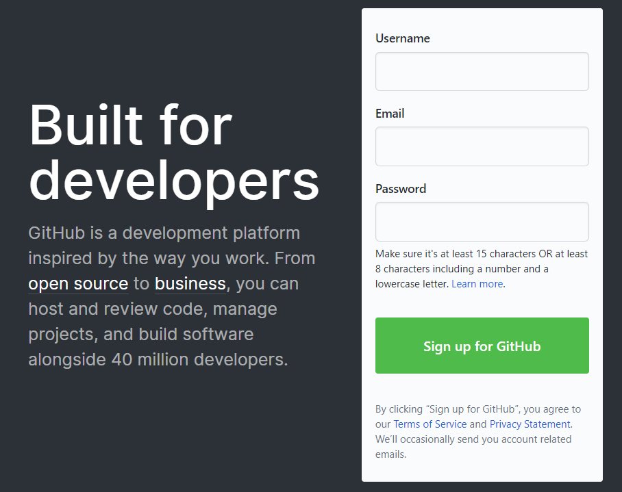
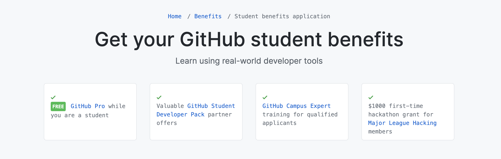
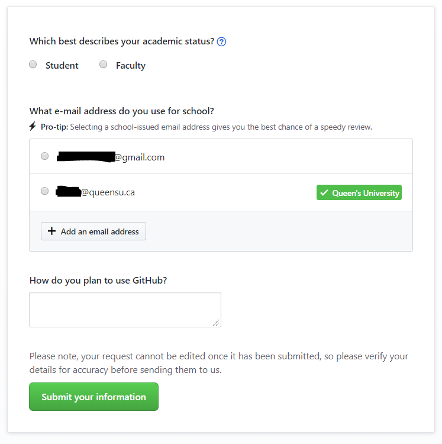
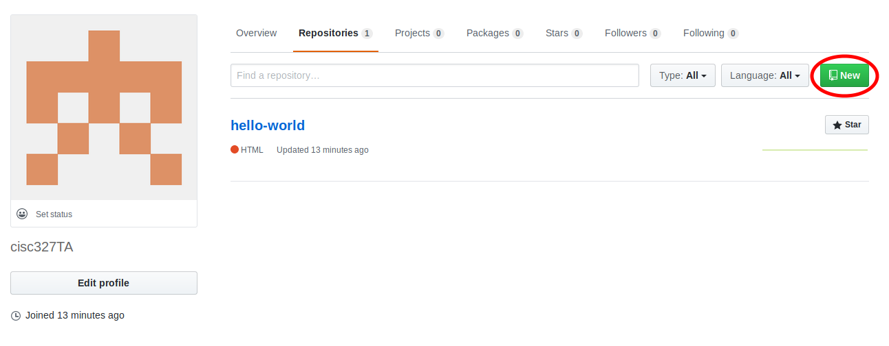
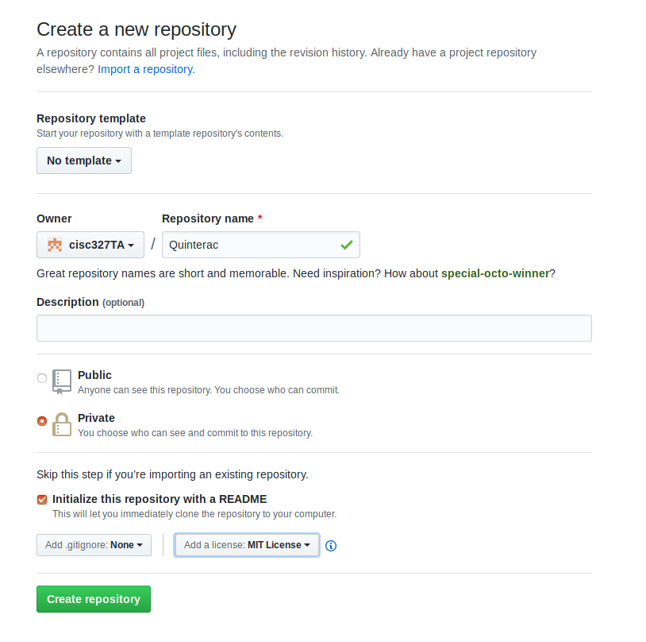
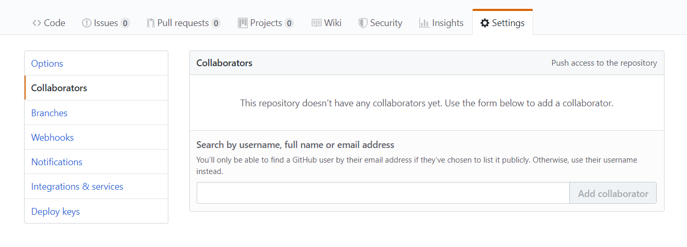
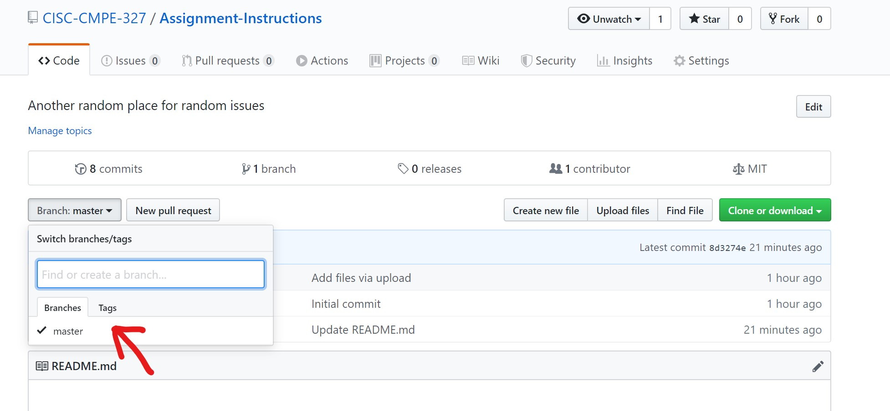

<h1 align="center"> :fire: GitHub Basics for Assignment Submission :fire: </h1>


<p align="center">


</p>

<p align="center">
:+1: Created By: Matt Dixon, Cesur Kavaslar, Andrew Boulos, Leo Song, Steven Ding (who adds Emoji and the badges)
</p>
<p align="center">
:sparkles: Pull request welcomed! You name will be added here!!
</p>
<table>
  <tr>
    <td align="center"><a href="https://l1nna.com/"><br /><sub><b>Steven Ding</b></sub></a><br /><a href="https://github.com/CISC-CMPE-327/Information/commits?author=steven-hh-ding" title="Code">💻</a> <a href="https://github.com/CISC-CMPE-327/Information/commits?author=steven-hh-ding" title="Documentation">📖</a></td>
    <td align="center"><a href="https://github.com/leordsong"><br /><sub><b>Leo Song</b></sub></a><br /><a href="https://github.com/CISC-CMPE-327/Information/commits?author=leordsong" title="Code">💻</a> <a href="https://github.com/CISC-CMPE-327/Information/commits?author=leordsong" title="Documentation">📖</a></td>
    <td align="center"><a href="https://github.com/reetamtaj"><br /><sub><b>Reetam Taj</b></sub></a><br /><a href="https://github.com/CISC-CMPE-327/Information/commits?author=reetamtaj" title="Code">💻</a> <a href="https://github.com/CISC-CMPE-327/Information/commits?author=reetamtaj" title="Documentation">📖</a></td>
    <td align="center"><a href="https://github.com/charasyn"><br /><sub><b>Cooper Harasyn</b></sub></a><br /><a href="https://github.com/CISC-CMPE-327/Information/commits?author=charasyn" title="Code">💻</a> <a href="https://github.com/CISC-CMPE-327/Information/commits?author=charasyn" title="Documentation">📖</a></td>
    <td align="center"><a href="https://github.com/THardy98"><br /><sub><b>Thomas Hardy</b></sub></a><br /><a href="https://github.com/CISC-CMPE-327/Information/commits?author=THardy98" title="Code">💻</a> <a href="https://github.com/CISC-CMPE-327/Information/commits?author=THardy98" title="Documentation">📖</a></td>
    <td align="center"><a href="https://github.com/aubreymcleod"><br /><sub><b>aubreymcleod</b></sub></a><br /><a href="https://github.com/CISC-CMPE-327/Information/commits?author=aubreymcleod" title="Code">💻</a> <a href="https://github.com/CISC-CMPE-327/Information/commits?author=aubreymcleod" title="Documentation">📖</a></td>
    <td align="center"><a href="https://github.com/adamhirani"><br /><sub><b>Adam</b></sub></a><br /><a href="https://github.com/CISC-CMPE-327/Information/commits?author=adamhirani" title="Code">💻</a> <a href="https://github.com/CISC-CMPE-327/Information/commits?author=adamhirani" title="Documentation">📖</a></td>
  </tr>
</table>

<p align="center">
  
</p>
<p align="center">
  <p align="center">[Credits: LammyJams]</p>
</p>


## 1. Create GitHub Account :star:
Many of you may already have a GitHub account, if you do you can skip this step. If you don’t have an account, go to [github.com](github.com) and create one:

<p align="center">
  
</p>

We recommend you choose the free plan for this course. You are able to skip all steps until you are asked to verify your email address. After verifying our email, you will be brought to your hello-world repository. 

## 2. Where to Ask a Question? :question:
There is an `issues` tab right up there :point_up:. Cannot find it? Click <a href='https://github.com/CISC-CMPE-327/Information-2021/issues'>HERE</a>. To ask a question, follow two steps:

- Frist, search for related issue using the `Filters` box. 
- If no one asked before, create an issue with a title that summazie your whole question. Then fill in the body of your question. You can copy screenshot and parse into the text box as well. 

## 3. Add Education License :heartpulse:
Go to https://education.github.com/discount_requests/new and add your Queen’s email to receive GitHub’s Education benefits for free.

<p align="center">
  
</p>

<p align="center">
  
</p>


You will be asked to verify the account in Email Settings. Once the address is verified, your benefits should be accessible.

## 4. Create a Private GitHub Repository (one-per-team) :zap:
Now that you have an account, you can create your repository (repo) for the course. Only one person per group needs to create a repo. 
Navigate to your repositories page and click the green button in the upper-right labeled `New` to create a new repo. 


<p align="center">
  
</p>


Name your repo and make sure to change your repo to Private. As well, you’ll want to initialize your repo with a README file and add the license you chose for your project in Assignment 0. Also pick a `.gitignore` file according to your chosen programming language (e.g. python). Basically it contains list of rules to ignore certain file extensions to be tracked in the repository (so basically they are ignored).


<p align="center">
  
</p>


## 5. Add Collaborators :ocean:
Go to the Settings tab of your new repository and select the Collaborators option on the left.

<p align="center">
  
</p>


First, add each of your team members’ GitHub Accounts as collaborators to the repo.
Next, add each of the TA’s accounts as collaborators as well - this will allow us to mark your assignments:

- 327qabot
- leoabot  
- TBA

Congratulations, you’ve finished setting up your repo and now it’s time to start working! If you are unable to add more than 3 collaborators, make sure that you have added in your educational license in the 3 step.


## 6. Clone the Repository to Your Laptop :muscle:

Open a terminal on your laptop and let's create a local copy of your GitHub repository by:
```
git clone your_repository_homepage_url
```
You will be asked to sign in GitHub. Now open your file explorer or finder, you will find that there is now a new folder created. It contains the files from your repository.


## 7. Committing changes to Github :facepunch:

You can make changes to your local repository in any ways you want. For example, you can download the course project contract template [A0-contract.md](A0-contract.md) and put it folder (don't fill in the details/information, just the template). But make sure that you didn't modify the `.git` folder which contains repository data that tracks the changes you made over time. 

Every time you would like to commit your code to the repository, make sure that you have downloaded all the remote changes (made by other people) by executing:
```
git pull 
```
If there is any error, possibly caused by the modification conflict made by you and the others, merge and address any changes in the files accordling. You can take a look at the changes you have made to the local repository if you want:
```
git diff
```
Now, we are ready to commit our code. First, we add all the changes we made.
```
git add .
```
Then, we create a local commit with a message:
```
git commit -m "yo this is a message for the commit, it supports emoji!"
```
Then we push the local commit to GitHub:
```
git push
```
Done! Check your repository home page. You will see the updated files. 

## 8. Branches and PRs :facepunch:

In the last example, we directly make changes to the master branch (the main branch of the repository). However, **this is not allowed** later in this course. You can only make changes to the main repository branch through feature branch and pull reqeust merge. Now, at your computer, open a terminal from your local repository. Create a feature branch locally: 

```
git checkout -b a_meaningful_branch_name
```

This will create a new branch named `a_meaningful_branch_name`, and switches your local repository from the original main branch (master) to `a_meaningful_branch_name`. When naming branches, please keep it space-free, short, concise, and human-friendly (e.g. `b0293x` is not a meaningful name). If you want to list all the branches available, you can use the command `git branch -v`. 

Now, you will see exactly the same files like you do before you create the new branch. The new branch actually just inherits everything from the main branch when you issue the checkout command. It is time to make some changes. You can now implement new features of your system on your own local branch, without affacting both your local main branch and the remote main branch on GitHub. As an example for A0, if you follow the previous steps to add the contract template into your GitHub repository, now you can edit that file and fill in your name, save changes, and commit. 

Then, we can push our changes (the updated template with your name) to the cloud, along with the created new branch:
```
git push origin -u a_meaningful_branch_name
```

After, you should be able to see your new branch with your changes on the GitHub webpage from here: 

<p align="center">
  
</p>

If you click your branch name, it will jump to the branch and show you its files. Once you are happy with the changes you have made, you can create a pull request. If not, you can continue the process of editing, committing, and pushing to your current new branch. 

The purpose of a pull request (PR) is to seek reviews and approvals for merging your changes to the main branch. To do this, go to the pull requests page of your GitHub repository, and click the green `new pull request` button. 


You can see there are two dropdown boxes connected with an arrow horizontally pointing to the left. This indicates the target branch and the source branch to be merged in this PR. Basically in a PR, we are migrating the changes from the source branch (right dropdown) to the target branch (left dropdown). The left dropdown box already selects your main/master branch, and now you can select your branch from the right dropdown, click `create pull request`:


fill in the tile, the comments, add all your team members as reviewers on the right panel, assign yourself on the right panel. The other settings such as labels, are optional but recommended. For milestone, you can add a new milestone `contract signing` for this PR. Later on it can be our different stages of projects, such as `sprint-1`, `sprint-2`, etc. 

Your teammate should have recieved a notification. Ask them to review, leave comments (even if there is no issue of your branch), and click approve for your PR. Once everyone approved your PR, you can click the `merge` button. After, you will be able to see your changes in your feature branch now got merged into the main repository. 


## 9. Creating a Tag for Assignment Submission :pray:

(For each assignment, specific instruction is given on how and what should your team submit. If not, by default, following the instruction below)

Now ready for submission? It is easy. Just create a tag of **current master (main) branch** of your code:
Switch to your main branch. (maybe `master` instead of `main` in the command below, depending on the name of your main branch)
```
git checkout main 
```
Then, create a new tag (like a release version)
```
git tag v0.0.1
```
v0.0.1 is your chosen name of current version. The conversion of the naming starts with `v`. You can put whatever number. This tag is just created locally. We need to push it to GitHub:
```
git push --tags
```
If the above command line does not work:
```
git push --follow-tags
```
You can checkout different tags on your repository home page here:

<p align="center">
  
</p>

Then submit the **link to your group repository** as well as the **tag name** to onQ. Want to update your submission? It is easy. Just create another **new tag**, and submit the **new tag name** and the **link to your group repository** to onQ. 

:clap::clap::clap::clap:
